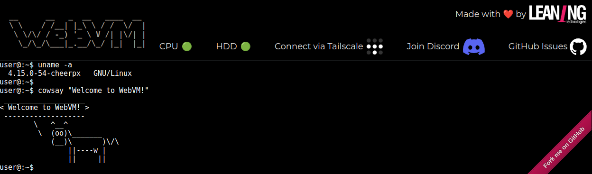

# WebVM

[](https://discord.gg/yWRr2YnD9c)
[](https://github.com/leaningtech/webvm/issues)

This repository hosts the source code for [https://webvm.io](https://webvm.io), a Linux virtual machine that runs in your browser.



WebVM is a server-less virtual environment running fully client-side in HTML5/WebAssembly. It's designed to be Linux ABI-compatible. It runs an unmodified Debian distribution including many native development toolchains.

WebVM is powered by the CheerpX virtualization engine, and enables safe, sandboxed client-side execution of x86 binaries on any browser. CheerpX includes an x86-to-WebAssembly JIT compiler, a virtual block-based file system, and a Linux syscall emulator. 

# Enable networking

- Click "Connect via Tailscale" in the page header.
- Log in to Tailscale (create an account if you don't have one).
- If you are unfamiliar with Tailscale or would like additional information see [WebVM and Tailscale](/docs/Tailscale.md).

# Fork, deploy, customize


- Fork the repository.
- Enable Github pages in settings.
	- Click on `Settings`.
	- Go to the `Pages` section.
	- Select `Github Actions` as the source.
        - If you are using a custom domain, ensure `Enforce HTTPS` is enabled. 
- Run the workflow.
	- Click on `Actions`.
	- Accept the prompt. This is required only once to enable Actions for your fork.
	- Click on the workflow named `Deploy`.
	- Click `Run workflow` and then once more `Run workflow` in the menu.
- After a few seconds a new `Deploy` workflow will start, click on it to see details.
- After the workflow completes, which takes a few minutes, it will show the URL below the `deploy_to_github_pages` job.


You can now customize `dockerfiles/debian_mini` to suits your needs, or make a new Dockerfile from scratch. Use the `Path to Dockerfile` workflow parameter to select it.

# Local deployment

From a local `git clone`

- Download the `debian_mini` Ext2 image from [https://github.com/leaningtech/webvm/releases/](https://github.com/leaningtech/webvm/releases/).
	- You can also build your own by selecting the "Upload GitHub release" workflow option.
	- Place the image in the repository root folder.
- Edit `index.html`.
	- Uncomment the default values for `CMD`, `ARGS`, `ENV` and `CWD`.
	- Replace `DEVICE_TYPE` with `"bytes"`.
	- Replace `IMAGE_URL` with the name of the Ext2 image. For example `"debian_mini_20230519_5022088024.ext2"`.
- Start a local HTTP server.
- Enjoy your local WebVM.

# Example customization: Python3 REPL

The `Deploy` workflow takes into account the `CMD` specified in the Dockerfile. To build a REPL you can simply apply this patch and deploy.

```diff
diff --git a/dockerfiles/debian_mini b/dockerfiles/debian_mini
index 2878332..1f3103a 100644
--- a/dockerfiles/debian_mini
+++ b/dockerfiles/debian_mini
@@ -15,4 +15,4 @@ WORKDIR /home/user/
 # We set env, as this gets extracted by Webvm. This is optional.
 ENV HOME="/home/user" TERM="xterm" USER="user" SHELL="/bin/bash" EDITOR="vim" LANG="en_US.UTF-8" LC_ALL="C"
 RUN echo 'root:password' | chpasswd
-CMD [ "/bin/bash" ]
+CMD [ "/usr/bin/python3" ]
```

# Bugs and Issues

Please use [Issues](https://github.com/leaningtech/webvm/issues) to report any bug.
Or come to say hello / share your feedback on [Discord](https://discord.gg/yTNZgySKGa).

# More links

- [WebVM: server-less x86 virtual machines in the browser](https://leaningtech.com/webvm-server-less-x86-virtual-machines-in-the-browser/)
- [WebVM: Linux Virtualization in WebAssembly with Full Networking via Tailscale](https://leaningtech.com/webvm-virtual-machine-with-networking-via-tailscale/)
- [Mini.WebVM: Your own Linux box from Dockerfile, virtualized in the browser via WebAssembly](https://leaningtech.com/mini-webvm-your-linux-box-from-dockerfile-via-wasm/)
- Reference GitHub Pages deployment: [Mini.WebVM](https://mini.webvm.io)
- [Crafting the Impossible: X86 Virtualization in the Browser with WebAssembly](https://www.youtube.com/watch?v=VqrbVycTXmw) Talk at JsNation 2022

# Thanks to... 
This project depends on:
- [CheerpX](https://labs.leaningtech.com/cheerpx), made by [Leaning Technologies](https://leaningtech.com) for x86 virtualization and Linux emulation
- xterm.js, [https://xtermjs.org/](https://xtermjs.org/), for providing the Web-based terminal emulator
- [Tailscale](https://tailscale.com/), for the networking component
- [lwIP](https://savannah.nongnu.org/projects/lwip/), for the TCP/IP stack, compiled for the Web via [Cheerp](https://github.com/leaningtech/cheerp-meta)

# Versioning

WebVM depends on the CheerpX x86-to-WebAssembly virtualization technology. A link to the current latest build is always available at [https://cheerpxdemos.leaningtech.com/publicdeploy/LATEST.txt](https://cheerpxdemos.leaningtech.com/publicdeploy/LATEST.txt). Builds of CheerpX are immutable and uniquely versioned. An example link would be:

`https://cheerpxdemos.leaningtech.com/publicdeploy/20230517_94/cx.js`

We strongly encourage users _not_ to use the latest build. Please directly use a specific build to avoid unexpected regressions. Since builds are immutable, if they work for you now they will keep working forever.

# License

WebVM is released under the Apache License, Version 2.0.

You are welcome to use, modify, and redistribute the contents of this repository.

The public CheerpX deployment is provided **as-is** and is **free to use** for technological exploration, testing and non-commercial uses. Downloading a CheerpX build for the purpose of hosting it elsewhere is not permitted.

If you want to build a product on top of CheerpX/WebVM, please get in touch: sales@leaningtech.com
